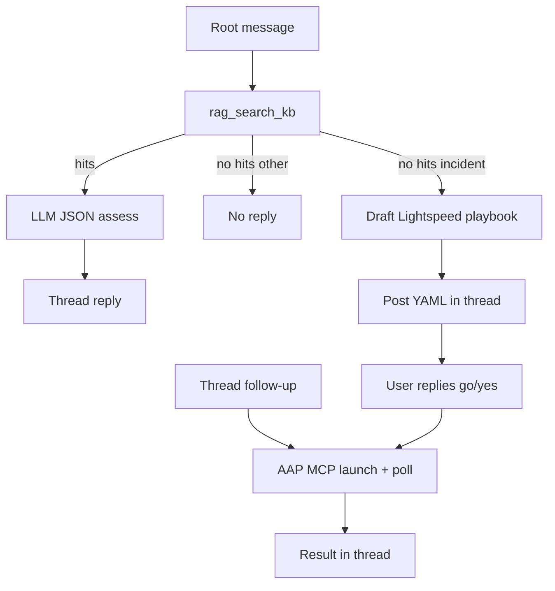

# ITSM Agent Bot

A channel bot for **demo-chat** that answers from the **itsm-app** knowledge base (RAG) and runs Ansible Automation Platform jobs via **AAP MCP** when the user completes a thread conversation.

The bot connects over WebSocket to a single chat channel, searches KB articles with MCP `rag_search_kb`, summarizes hits with LiteLLM, replies **in the message thread**, and launches matching controller templates through MCP after the user supplies any required inputs.

## How it works

1. **Subscribe** — Logs into demo-chat, joins the channel from `CHANNEL_NAME` or `CHANNEL_ID`, and listens for `message_created` events (ignores its own messages).
2. **Root message** — Any new top-level user message triggers RAG search. For **incident** notifications, the bot may route to Apache troubleshoot (when a matching KB applies) or draft a Lightspeed remediation playbook for in-thread review when no runbook applies.
3. **Thread reply** — When RAG hits apply, the bot posts its answer as a **thread reply** (`parent_id` = the user's message id).
4. **Collect info** — If the KB procedure needs extra values, the bot asks for them in the same thread and keeps session state in memory.
5. **Launch via MCP** — When inputs are complete (or the user replies `go` / `yes`), the bot opens an ITSM catalog service request when the KB requires it (`create_request` → `add_ritm` → `submit_request`), then resolves and launches the AAP workflow template, polls to completion, and posts stdout/status in the thread.



Health endpoints on port `8080` (default):

| Path       | Purpose |
|-----------|---------|
| `/healthz` | Liveness — always 200 |
| `/readyz`  | Readiness — 503 until WebSocket subscribe succeeds |

## Prerequisites

- **demo-chat** — REST + WebSocket API; a bot user and target channel.
- **itsm-app** — MCP at `{ITSM_BASE_URL}/mcp/` with `rag_search_kb`.
- **LiteLLM** (or any OpenAI-compatible API) — For structured KB assessment.
- **AAP MCP** (optional) — HTTP MCP gateway with controller tools (`AAP_MCP_BASE_URL`, `AAP_MCP_TOKEN`).

## Configuration

Copy [`k8s/secret_template.yaml`](k8s/secret_template.yaml) to `k8s/secret.yaml` (gitignored), fill in values, and apply. The deployment loads all keys from Secret `itsm-agent-secrets`.

### Required

| Variable | Description |
|----------|-------------|
| `CHAT_BASE_URL` | demo-chat origin, e.g. `http://demo-chat.demo-chat.svc.cluster.local:8000` |
| `CHAT_USERNAME` / `CHAT_PASSWORD` | Bot credentials |
| `CHANNEL_NAME` **or** `CHANNEL_ID` | Channel to join |
| `ITSM_BASE_URL` | itsm-app origin (MCP at `{ITSM_BASE_URL}/mcp/`) |
| `LLM_BASE_URL` | LiteLLM base, with or without `/v1` |
| `LLM_MODEL` | Model id, e.g. `llama-scout-17b` |
| `LLM_API_KEY` | Bearer token for LiteLLM |

### Optional

| Variable | Description |
|----------|-------------|
| `ITSM_MCP_TOKEN` | `X-ITSM-MCP-Token` or Bearer for protected itsm MCP |
| `RAG_TOP_K` | Max KB hits (default `5`) |
| `HEALTH_PORT` | Health server port (default `8080`) |
| `LOG_LEVEL` | Logging level (default `INFO`) |
| `AAP_MCP_BASE_URL` | AAP MCP gateway origin (MCP at `{base}/mcp/`) |
| `AAP_MCP_TOKEN` | Bearer token for AAP MCP |
| `AAP_CONTROLLER_UI_URL` | Controller UI origin for job links |
| `AAP_JOB_POLL_INTERVAL_SEC` / `AAP_JOB_POLL_TIMEOUT_SEC` | Poll tuning (defaults `5` / `3600`) |
| `AAP_TLS_VERIFY` | Set `false` to skip TLS verify for AAP MCP (lab/self-signed) |
| `AAP_LIGHTSPEED_WORKFLOW` | AAP workflow template for Lightspeed remediation (default `Lightspeed Remediation`) |
| `AAP_LIGHTSPEED_API_URL` | Ansible Lightspeed playbook generation endpoint |
| `AAP_LIGHTSPEED_API_TOKEN` | Bearer token for Lightspeed API |
| `AAP_LIGHTSPEED_TLS_VERIFY` | TLS verify for Lightspeed HTTP client (default `true`) |
| `AAP_LIGHTSPEED_ALLOW_LITELLM_FALLBACK` | Fall back to LiteLLM when Lightspeed returns 401/404/503 (default `true`) |
| `AAP_APACHE_TROUBLESHOOT_JT` | Job template for Apache troubleshoot incidents (default `Troubleshoot apache application`) |
| `ITSM_KB_APACHE_TROUBLESHOOT_TITLE` | KB title that triggers Apache troubleshoot routing |

On workflow launch, the bot can enrich AAP `extra_vars` from ITSM **Generic Application** assets: `rpm_packages` → `apache_app_rpm_packages`, `enabled_services` → `apache_app_enabled_services`, `app_clone_path` → `apache_app_docroot`, plus derived legacy vars (`apache_app_package`, `apache_app_git_package`, `apache_app_service`). See [`bot/apache_assets.py`](bot/apache_assets.py).

For **incident** messages without a matching KB runbook, the bot drafts a remediation playbook via Ansible Lightspeed (or LiteLLM fallback), posts the YAML in-thread for review, then launches `AAP_LIGHTSPEED_WORKFLOW` with `ansible_playbook` and `limit` extra vars when the user confirms. See [`bot/lightspeed_remediation.py`](bot/lightspeed_remediation.py).

## Local run

```bash
python3 -m venv .venv
source .venv/bin/activate
pip install -r requirements.txt

export CHAT_BASE_URL=...
export CHAT_USERNAME=...
export CHAT_PASSWORD=...
export CHANNEL_NAME=...
export ITSM_BASE_URL=...
export LLM_BASE_URL=...
export LLM_MODEL=...
export LLM_API_KEY=...
# optional AAP_MCP_* ...
# optional AAP_LIGHTSPEED_* / AAP_APACHE_TROUBLESHOOT_JT / ITSM_KB_APACHE_TROUBLESHOOT_TITLE

PYTHONPATH=src:. python -m itsm_agent.main
```

## Deploy on OpenShift

```bash
oc apply -f k8s/namespace.yaml
oc apply -f k8s/secret.yaml   # after filling values
oc project itsm-agent
oc new-build --name=itsm-agent --binary --strategy=docker -n itsm-agent || true
oc start-build itsm-agent --from-dir=. --follow -n itsm-agent
oc apply -f k8s/deployment.yaml
oc rollout status deployment/itsm-agent -n itsm-agent
```

## Project layout

| Path | Purpose |
|------|---------|
| [`bot/runner.py`](bot/runner.py) | WebSocket loop, root/thread handlers |
| [`bot/knowledge.py`](bot/knowledge.py) | RAG via MCP |
| [`bot/llm.py`](bot/llm.py) | Structured LLM assessment |
| [`bot/aap_mcp.py`](bot/aap_mcp.py) | Template resolve, launch, poll via AAP MCP |
| [`bot/apache_assets.py`](bot/apache_assets.py) | Map ITSM Generic Application assets to AAP extra_vars |
| [`bot/lightspeed_remediation.py`](bot/lightspeed_remediation.py) | Ansible Lightspeed incident remediation and playbook review |
| [`bot/sessions.py`](bot/sessions.py) | In-memory thread session state |
| [`bot/chat.py`](bot/chat.py) | demo-chat login and thread replies |
| [`src/itsm_agent/main.py`](src/itsm_agent/main.py) | Container entrypoint |

## Notes

- Thread sessions are **in-memory**; pod restarts clear pending conversations.
- The bot does **not** reply when RAG finds nothing for non-incident messages, or when the LLM marks excerpts as not applicable.
- If itsm-app RAG is not configured (`rag_not_configured`), the bot falls back to MCP `search_kb` for keyword matches only.
- KB articles should name AAP templates explicitly (e.g. `Job template "[JT] …"`) for launch to work.
